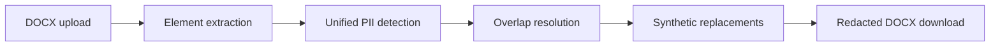

# PIIShield — Enterprise Data Assignment

This is the public-safe deployment copy for the Scaler AI Labs PII Redaction Tool assignment. The original prospectus and raw extraction layers are intentionally excluded from this repository to prevent publishing source PII. Use the Streamlit frontend in `app.py`, the [phase-wise documentation](docs/phases/README.md), and the [evaluation report](evaluation/evaluation_report.md).

## Frontend deployment

The upload interface is a small Streamlit application. It accepts a DOCX, runs the unified detector, reconstructs a separate redacted DOCX, and exposes the result as a download. `render.yaml` is included for Render deployment.

```powershell
pip install -r requirements-deploy.txt
streamlit run app.py
```

For Render, create a new Web Service from this repository and use the included `render.yaml` blueprint. The hosting account must supply its own deployment URL; this repository does not contain credentials or raw source documents.

The complete local submission package is kept separately under `abc/`; this public repository contains only the deployable project surface.

PIIShield is a reproducible DOCX privacy pipeline. It extracts document content into Bronze and Silver layers, detects the nine required PII categories, resolves overlapping candidates, replaces values deterministically, writes a redacted DOCX, and records evidence in Gold-layer outputs.

## Verification snapshot

- 69 automated tests pass in the full local package.
- The application supports PERSON, EMAIL, PHONE, COMPANY, ADDRESS, SSN, CREDIT_CARD, DOB, and IP_ADDRESS.
- The labeled regression report is in `evaluation/evaluation_report.md`.
- The public repository excludes the original prospectus and raw Bronze/Silver data.

## Architecture



## Public project structure

- `app.py` — Streamlit upload and download frontend.
- `src/` — detection, normalization, replacement, redaction, security, and access-control code.
- `tests/` — detector and pipeline regression tests.
- `docs/` — architecture, phase, security, and testing documentation.
- `evaluation/` — labeled ground truth and metrics report.
- `render.yaml` — Render Web Service configuration.
