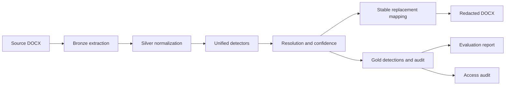

# PIIShield — Enterprise Data Assignment

This is the public-safe deployment copy for the Scaler AI Labs PII Redaction Tool assignment. The original prospectus and raw extraction layers are intentionally excluded from this repository to prevent publishing source PII. Use the Streamlit frontend in `app.py`, the [phase-wise documentation](docs/phases/README.md), and the [evaluation report](evaluation/evaluation_report.md).

## Frontend deployment

The upload interface is a small Streamlit application. It accepts a DOCX, runs the unified detector, reconstructs a separate redacted DOCX, and exposes the result as a download. `render.yaml` is included for Render deployment.

```powershell
pip install -r requirements-deploy.txt
streamlit run app.py
```

For Render, create a new Web Service from this repository and use the included `render.yaml` blueprint. The hosting account must supply its own deployment URL; this repository does not contain credentials or raw source documents.

This is the curated `abc` submission copy. Start with [SUBMISSION_README.md](SUBMISSION_README.md), then review [EVALUATION_STRATEGY.md](EVALUATION_STRATEGY.md) and [SUBMISSION_FORM_CHECKLIST.md](SUBMISSION_FORM_CHECKLIST.md) before sharing links or uploading files.

PIIShield is a reproducible DOCX privacy pipeline. It extracts document content into Bronze and Silver layers, detects the nine required PII categories, resolves overlapping candidates, replaces values deterministically, writes a redacted DOCX, and records evidence in Gold-layer outputs.

## Assignment coverage

| Requirement | Implementation | Status |
|---|---|---|
| DOCX ingestion | Paragraphs, table cells, headers, footers, and core metadata | Complete |
| ETL layers | Bronze JSONL → normalized Silver Parquet → Gold outputs | Complete |
| Required PII | PERSON, EMAIL, PHONE, COMPANY, ADDRESS, SSN, CREDIT_CARD, DOB, IP_ADDRESS | Complete |
| Replacement | Stable category-aware synthetic values | Complete |
| Redaction | Paragraphs, tables, headers, footers, and metadata sanitization | Complete |
| Security controls | Hashing, HMAC tokenization, masking, IP generalization | Complete |
| Access control | Local RBAC simulation with CSV audit trail | Complete |
| Evaluation | Labeled cases with accuracy, precision, recall, and F1 | Complete |
| Submission artifact | `output/redacted_prospectus.docx` | Complete |

## Architecture



## Quick start

Run the full pipeline from the project root:

```powershell
.\venv\Scripts\python.exe run.py
```

Run the labeled evaluation independently:

```powershell
.\venv\Scripts\python.exe src\evaluate.py
```

Run all tests:

```powershell
.\venv\Scripts\pytest.exe tests -q
```

## Key outputs

- `data/bronze/document_elements.jsonl` — source elements, including headers, footers, and metadata.
- `data/silver/normalized_elements.parquet` — normalized elements consumed by detectors.
- `data/silver/detected_entities.parquet` — resolved detection records with offsets and confidence.
- `data/gold/redacted_entities.parquet` — replacement and redaction records.
- `data/gold/audit_log.csv` — per-entity audit trail.
- `data/gold/access_audit.csv` — simulated RBAC access decisions.
- `data/gold/pii_summary.csv` — category counts and replacement summary.
- `data/gold/evaluation_metrics.json` — pipeline-run count summary.
- `evaluation/evaluation_report.md` — labeled evaluation report.
- `evaluation/evaluation_metrics.json` — labeled accuracy, precision, recall, and F1 metrics.
- `output/redacted_prospectus.docx` — reconstructed redacted document.

## Latest verification snapshot

| Metric | Result |
|---|---:|
| Silver elements processed | 4,288 |
| Detector candidates | 988 |
| Redactions applied | 916 |
| Labeled cases | 12 |
| Overall accuracy / precision / recall / F1 | 1.0000 / 1.0000 / 1.0000 / 1.0000 |
| Automated tests | 69 passed |

## Documentation

- [Phase-wise implementation guide](docs/phases/README.md)
- [Detailed documentation index](docs/README.md)
- [Architecture](docs/architecture.md)
- [Testing and verification](docs/testing.md)
- [Security controls](docs/security.md)
- [Evaluation methodology](docs/evaluation.md)
- [Detector notes](docs/detectors/unified.md)

## Design trade-offs

The pipeline favors traceability and conservative deterministic replacement over aggressive language-model inference. Regex and validation provide precision for structured values; spaCy and contextual rules provide broader coverage for people, companies, and addresses. The local security and RBAC modules are educational controls for the assignment and are not a substitute for a managed secrets store, enterprise identity provider, or production key-management service.