# PIIShield documentation

PIIShield is a layered PII detection pipeline for DOCX documents. The system preserves source text, detects entities with category-specific strategies, and returns traceable entity records with offsets and confidence.

Start with the [root README](../README.md) for setup and the [phase-wise implementation guide](phases/README.md) for the assignment plan.

## Documentation map

| Area | Documentation |
|---|---|
| End-to-end architecture | [architecture.md](architecture.md) |
| Detection pipeline | [detectors/unified.md](detectors/unified.md) |
| Redaction and replacements | [phase4_redaction.md](phase4_redaction.md) |
| Gold outputs and auditability | [phase5_outputs.md](phase5_outputs.md) |
| Email | [detectors/email.md](detectors/email.md) |
| Phone | [detectors/phone.md](detectors/phone.md) |
| IP address | [detectors/ip.md](detectors/ip.md) |
| Credit card | [detectors/credit_card.md](detectors/credit_card.md) |
| SSN | [detectors/ssn.md](detectors/ssn.md) |
| Person | [detectors/person.md](detectors/person.md) |
| Company / organization | [detectors/company.md](detectors/company.md) |
| Address | [detectors/address.md](detectors/address.md) |
| Date of birth | [detectors/dob.md](detectors/dob.md) |
| Test strategy | [testing.md](testing.md) |
| Security controls | [security.md](security.md) |
| Evaluation methodology | [evaluation.md](evaluation.md) |
| Phase-wise implementation | [phases/README.md](phases/README.md) |

## Detector inventory

| Entity type | Implementation | Test file | Strategy |
|---|---|---|---|
| EMAIL | `src/detectors/email.py` | `tests/test_email_detector.py` | Regex |
| PHONE | `src/detectors/phone.py` | `tests/test_phone_detector.py` | Regex + `phonenumbers` |
| IP_ADDRESS | `src/detectors/ip.py` | `tests/test_ip_detector.py` | Regex + `ipaddress` |
| CREDIT_CARD | `src/detectors/credit_card.py` | `tests/test_credit_card_detector.py` | Regex + Luhn |
| SSN | `src/detectors/ssn.py` | `tests/test_ssn_detector.py` | Regex + context |
| PERSON | `src/detectors/person.py` | `tests/test_person_detector.py` | spaCy NER + rules |
| COMPANY | `src/detectors/company.py` | `tests/test_company_detector.py` | spaCy ORG + legal suffix rules |
| ADDRESS | `src/detectors/address.py` | `tests/test_address_detector.py` | PIN + context + span cleanup |
| DOB | `src/detectors/dob.py` | `tests/test_dob_detector.py` | Date regex + validation + context |

## Common execution

Run the complete test suite from the project root:

```powershell
.\venv\Scripts\pytest.exe tests -q
```

Run the unified prospectus detector:

```powershell
.\venv\Scripts\python.exe src\run_detection.py
```

Individual runners are available as `src/run_<category>_detection.py` for categories that have been inspected independently.

## Current phase status

```mermaid
flowchart LR
    A[Phase 0 policy] --> B[Phase 1 ingestion]
    B --> C[Phase 2 Silver layer]
    C --> D[Phase 3 detection]
    D --> E[Phase 4 redaction]
    E --> F[Phase 5 Gold outputs]
    F --> G[Phase 7 security]
    G --> H[Phase 8 access control]
    H --> I[Phase 9 evaluation]
    I --> J[Phase 10 submission]
```



The complete redaction workflow is:

```powershell
.\venv\Scripts\python.exe src\run_redaction.py
.\venv\Scripts\python.exe run.py
.\venv\Scripts\python.exe src\evaluate.py
```

## Latest verified run

| Metric | Result |
|---|---:|
| Silver elements processed | 4,288 |
| Detector candidates | 988 |
| Redactions applied | 916 |
| Labeled evaluation cases | 12 |
| Overall metrics | Accuracy 1.0000; precision 1.0000; recall 1.0000; F1 1.0000 |
| Automated tests | 69 passed |

Generated artifacts:

```text
data/silver/detected_entities.parquet
data/gold/redacted_entities.parquet
data/gold/audit_log.csv
data/gold/pii_summary.csv
data/gold/access_audit.csv
evaluation/evaluation_metrics.json
evaluation/evaluation_report.md
output/redacted_prospectus.docx
```