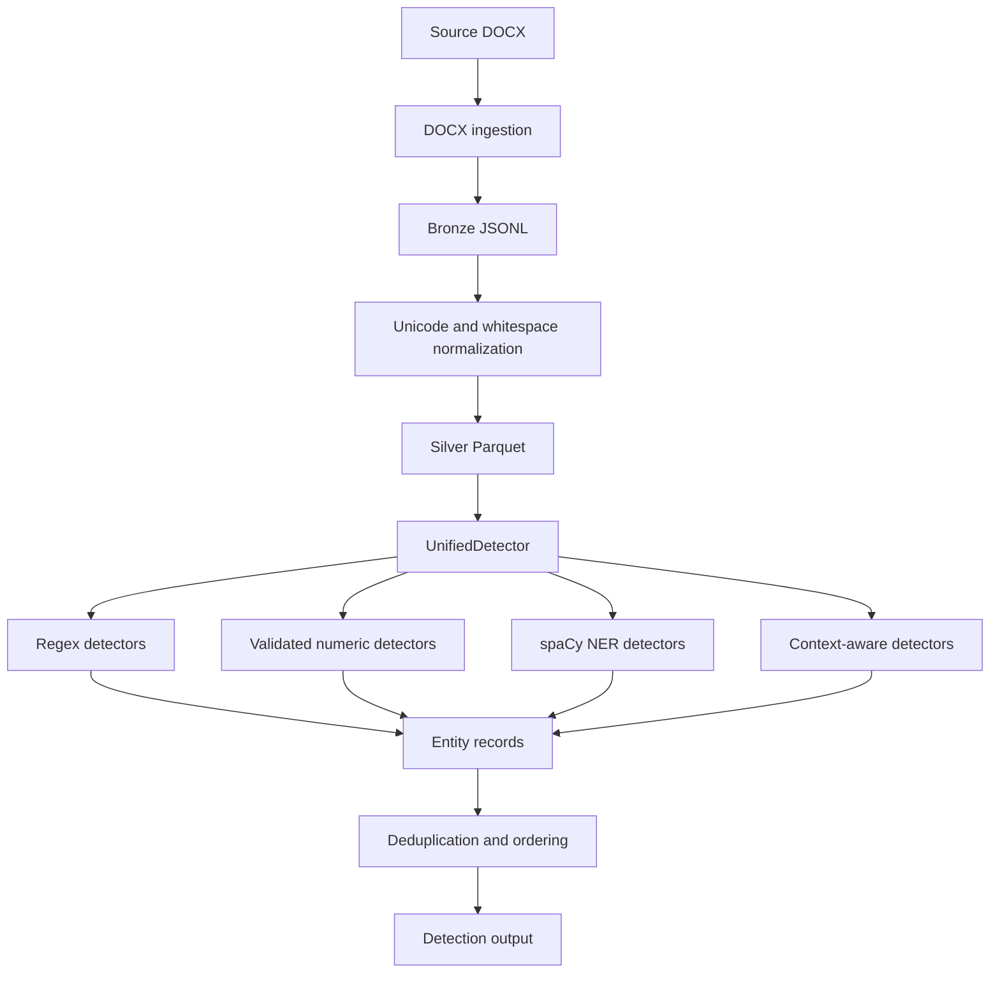
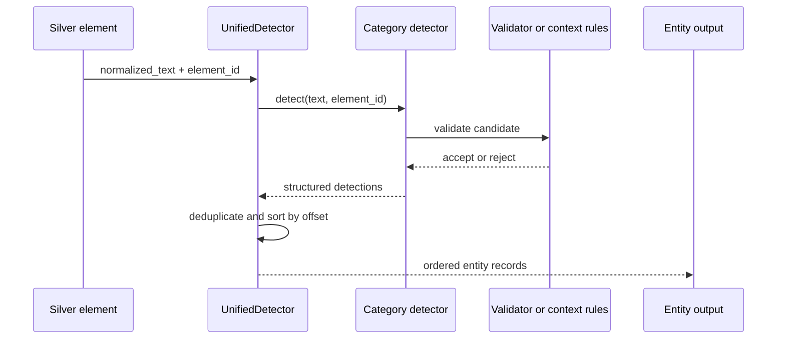
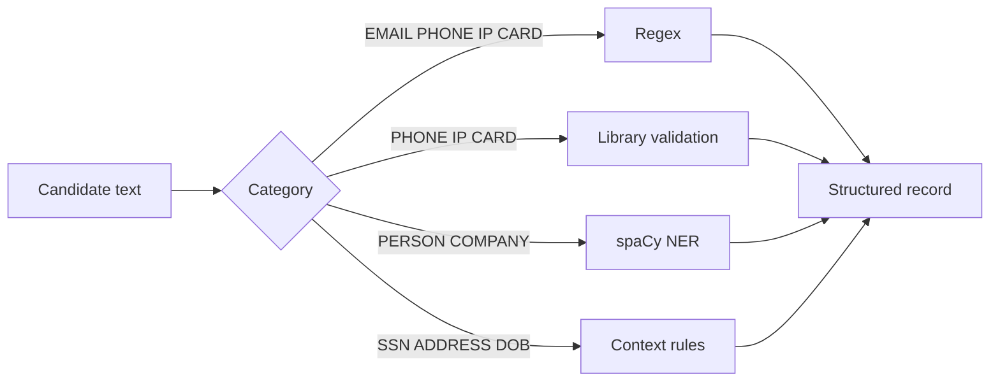

# PIIShield architecture

## End-to-end architecture



## Layer responsibilities

| Layer | Input | Output | Responsibility |
|---|---|---|---|
| Bronze | DOCX | JSONL | Preserve extracted paragraphs and table cells |
| Silver | Bronze JSONL | Parquet | Normalize text without losing the original |
| Detection | Silver Parquet | Entity records | Identify PII with offsets and confidence |
| Unified | Detector results | Ordered result set | Run all detectors and remove exact duplicates |

## Detection flow



## Detection record contract

Every detector returns a list of dictionaries with this shape:

```json
{
  "element_id": "P_00123",
  "entity_type": "EMAIL",
  "text": "someone@example.com",
  "start": 45,
  "end": 64,
  "confidence": 0.99,
  "detector": "email_regex"
}
```

Offsets are zero-based and end-exclusive. The invariant is:

```text
text[start:end] == detection["text"]
```

## Strategy selection



The system favors precision safeguards at the category boundary. A date is not a DOB without DOB context, a nine-digit value is not an SSN without SSN context, and an address candidate is trimmed to the actual PII span rather than preserving surrounding prose.