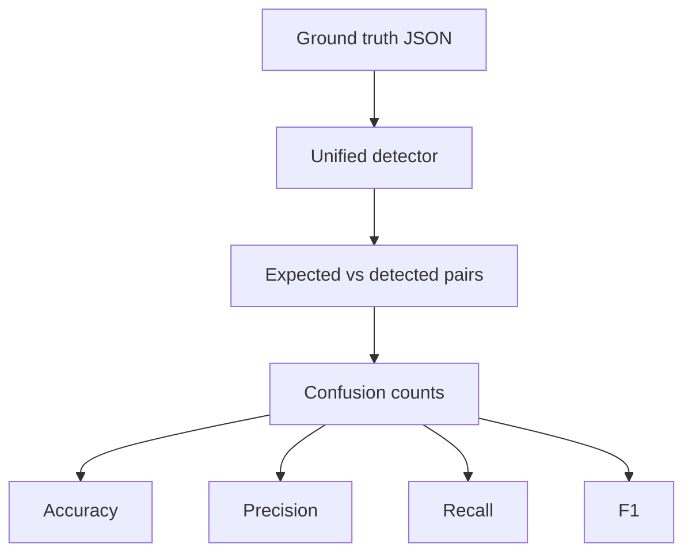

# Evaluation methodology

The evaluator reads `evaluation/ground_truth.json`, runs the unified detector for every labeled case, and compares `(entity_type, text)` pairs. It then writes category-level and micro-averaged accuracy, precision, recall, and F1 to `evaluation/evaluation_report.md` and `evaluation/evaluation_metrics.json`.



The labeled set is a compact regression suite covering all required categories plus negative examples. It is useful for acceptance testing, but it is not a statistically representative benchmark; expanding the labels with examples from the supplied prospectus would make the reported scores more meaningful.

Run it with:

```powershell
.\venv\Scripts\python.exe src\evaluate.py
```