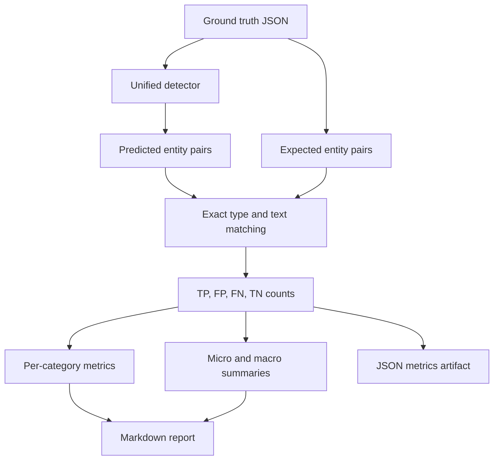

# PIIShield Evaluation Strategy and Metrics

## 1. Purpose

This document describes how PIIShield is tested, how expected detections are represented, how the reported metrics are calculated, and what the current results do and do not prove. The strategy is designed for a privacy-redaction pipeline, where both missed sensitive values and unnecessary redactions matter.

The evaluation has two complementary layers:

1. A repeatable labeled regression suite for detector correctness.
2. Full-pipeline verification for document reconstruction, replacement mapping, audit output, and operational behavior.

The first layer produces the published classification metrics. The second layer checks that correct detections become a usable redacted DOCX without damaging document structure.

## 2. Scope under test

The detector is evaluated against the nine assignment categories:

| Category | Examples covered by the implementation |
|---|---|
| PERSON | Named individuals in contact or business contexts |
| EMAIL | Standard email addresses |
| PHONE | Indian and international phone formats |
| COMPANY | Organization names supported by contextual rules and NER |
| ADDRESS | Office, plot, building, city, and postal-address patterns |
| SSN | Hyphenated Social Security number pattern |
| CREDIT_CARD | Card-like numbers validated with checksum logic |
| DOB | Dates identified by birth-date context |
| IP_ADDRESS | IPv4 addresses validated as network addresses |

The evaluation also includes non-PII controls. These controls are important because a useful redactor must avoid treating every date, reference number, city, or generic business phrase as personal information.

## 3. Test-set design

The current public regression set contains 12 small, readable cases:

| Test group | Cases | Purpose |
|---|---:|---|
| Positive category cases | 9 | One labeled example for every required PII category |
| Date control | 1 | Confirms that an ordinary agreement date is not automatically DOB |
| Identifier control | 1 | Confirms that reference and registration numbers are not SSNs or cards |
| Generic company control | 1 | Confirms that a generic phrase such as "The Company" is not a company entity |
| **Total** | **12** | **Compact regression suite** |

Each case is stored in `evaluation/ground_truth.json` with an identifier, input text, and expected entity list. The positive cases use synthetic or assignment-safe examples. The public repository does not include the original prospectus or raw Bronze/Silver extraction data.

### Ground-truth record

An expected entity is represented as:

```json
{
  "entity_type": "EMAIL",
  "text": "rashhi.patil@gmail.com"
}
```

A prediction is counted as correct only when both the category and the exact entity text match the expected record. This strict rule catches category confusion and span-boundary errors, including an address that accidentally includes a company name or trailing contact information.

## 4. Evaluation procedure

The evaluator follows the same detector path used by the application:

1. Load the labeled JSON cases.
2. Run the unified detector on each input.
3. Normalize the detector output into `(entity_type, text)` pairs.
4. Compare predictions with the expected pairs.
5. Count true positives, false positives, false negatives, and true negatives.
6. Calculate category-level and overall metrics.
7. Write a Markdown report and a machine-readable JSON metrics file.



## 5. Metric definitions

For each category, the evaluator uses the following counts:

- **True positive (TP):** an expected entity was detected with the correct category and exact text.
- **False positive (FP):** the detector reported an entity that was not expected in the case.
- **False negative (FN):** an expected entity was not detected exactly.
- **True negative (TN):** a labeled non-PII decision was correctly left undetected.

The metrics are calculated as follows:

```text
precision = TP / (TP + FP)
recall    = TP / (TP + FN)
F1        = 2 * precision * recall / (precision + recall)
accuracy  = (TP + TN) / (TP + FP + FN + TN)
```

When a denominator is zero, the evaluator uses a safe zero result instead of raising an exception. This keeps the report deterministic for categories that may be absent from a future test set.

### How the summaries are read

- **Per-category metrics** expose weaknesses hidden by aggregate scores.
- **Micro averages** pool all entity decisions and are useful for the total detector behavior.
- **Macro averages** give each category equal weight and are useful when rare categories must not be overshadowed by common ones.
- **Accuracy** is reported for completeness, but precision, recall, and F1 receive more attention for PII detection because class imbalance can make accuracy look strong even when sensitive values are missed.

## 6. Acceptance criteria

The regression suite is intended to act as a release gate. A change is acceptable when:

1. All nine required categories remain represented in the labeled set.
2. No existing positive case becomes a false negative.
3. Negative controls do not gain new false positives.
4. The exact address and company-name span regressions remain green.
5. The redaction pipeline still produces a readable DOCX and preserves tables, headers, footers, and metadata handling.
6. The full automated test suite passes.

For a larger production benchmark, the recommended target is category-level recall of at least 0.95 while maintaining precision of at least 0.95. Those thresholds are engineering goals for an expanded dataset, not a claim that a 12-case sample proves production-level performance.

## 7. Current measured results

The current labeled run contains 12 cases and 9 expected PII entities. It produced zero false positives and zero false negatives:

| Scope | Accuracy | Precision | Recall | F1 | TP | FP | FN | TN |
|---|---:|---:|---:|---:|---:|---:|---:|---:|
| PERSON | 1.0000 | 1.0000 | 1.0000 | 1.0000 | 1 | 0 | 0 | 11 |
| EMAIL | 1.0000 | 1.0000 | 1.0000 | 1.0000 | 1 | 0 | 0 | 11 |
| PHONE | 1.0000 | 1.0000 | 1.0000 | 1.0000 | 1 | 0 | 0 | 11 |
| COMPANY | 1.0000 | 1.0000 | 1.0000 | 1.0000 | 1 | 0 | 0 | 11 |
| ADDRESS | 1.0000 | 1.0000 | 1.0000 | 1.0000 | 1 | 0 | 0 | 11 |
| SSN | 1.0000 | 1.0000 | 1.0000 | 1.0000 | 1 | 0 | 0 | 11 |
| CREDIT_CARD | 1.0000 | 1.0000 | 1.0000 | 1.0000 | 1 | 0 | 0 | 11 |
| DOB | 1.0000 | 1.0000 | 1.0000 | 1.0000 | 1 | 0 | 0 | 11 |
| IP_ADDRESS | 1.0000 | 1.0000 | 1.0000 | 1.0000 | 1 | 0 | 0 | 11 |
| **Overall micro** | **1.0000** | **1.0000** | **1.0000** | **1.0000** | **9** | **0** | **0** | **99** |

These values are a verified regression result for the supplied labeled cases. They are not a statistical estimate of accuracy across every possible document or language style.

## 8. Full-pipeline verification

Detector metrics alone do not prove that the output document is safe or usable. The full project run additionally checks:

- Bronze extraction of paragraphs, tables, headers, footers, and core metadata.
- Silver normalization and stable element identifiers.
- Candidate resolution when detectors overlap.
- Deterministic category-aware replacement values.
- Redaction in paragraphs, tables, headers, and footers.
- Metadata sanitization.
- Gold detection, replacement, summary, and audit artifacts.
- Access-control simulation and access audit output.
- Structural validation of the reconstructed DOCX.

The latest full pipeline snapshot processed 4,288 Silver elements, produced 988 detector candidates, and applied 916 accepted redactions. The complete automated test suite reported 69 passing tests.

## 9. Reproducibility

Run the labeled evaluation from the repository root:

```powershell
python src\evaluate.py
```

Run the complete automated test suite:

```powershell
pytest tests -q
```

The evaluator writes:

- `evaluation/evaluation_report.md` - human-readable results.
- `evaluation/evaluation_metrics.json` - machine-readable metrics.

The exact implementation is in `src/evaluate.py`, and the labeled inputs are in `evaluation/ground_truth.json`.

## 10. Limitations and next steps

The current suite is deliberately compact and functions as a regression gate, not as a representative benchmark. It has one positive example per category and only three negative controls. It does not measure performance across languages, scanned PDFs, OCR errors, uncommon address formats, adversarial spacing, or a statistically sampled population.

The next evaluation expansion should add:

- Multiple positive and negative examples per category.
- Hard negatives for dates, identifiers, addresses, and organization names.
- Span-boundary cases with punctuation, line breaks, and trailing contact details.
- International phone, address, and date formats.
- OCR and malformed-input cases.
- A manually reviewed prospectus annotation set for document-level recall.
- Separate development and holdout sets to reduce tuning bias.

This separation between measured evidence and future targets keeps the report credible: the published score is reproducible, while the limitations make clear where additional validation is required before production use.

