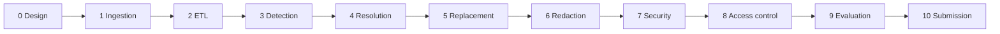

# PIIShield phase-wise guide

This directory maps the implementation to every phase in the assignment plan and transcript. Each phase page records its objective, implementation, evidence, and flow.

| Phase | Scope | Guide |
|---|---|---|
| 0 | Design, policy, and architecture | [phase_00_design.md](phase_00_design.md) |
| 1 | DOCX ingestion | [phase_01_ingestion.md](phase_01_ingestion.md) |
| 2 | Bronze/Silver/Gold ETL | [phase_02_etl.md](phase_02_etl.md) |
| 3 | PII detection | [phase_03_detection.md](phase_03_detection.md) |
| 4 | Resolution and confidence | [phase_04_resolution.md](phase_04_resolution.md) |
| 5 | Synthetic replacement | [phase_05_replacement.md](phase_05_replacement.md) |
| 6 | DOCX reconstruction | [phase_06_docx_redaction.md](phase_06_docx_redaction.md) |
| 7 | Security controls | [phase_07_security.md](phase_07_security.md) |
| 8 | Access control and audit | [phase_08_access_control.md](phase_08_access_control.md) |
| 9 | Evaluation | [phase_09_evaluation.md](phase_09_evaluation.md) |
| 10 | Submission package | [phase_10_submission.md](phase_10_submission.md) |

All phases are implemented in the current workspace. The remaining verification evidence is generated by `run.py`, `src/evaluate.py`, and the full pytest suite.