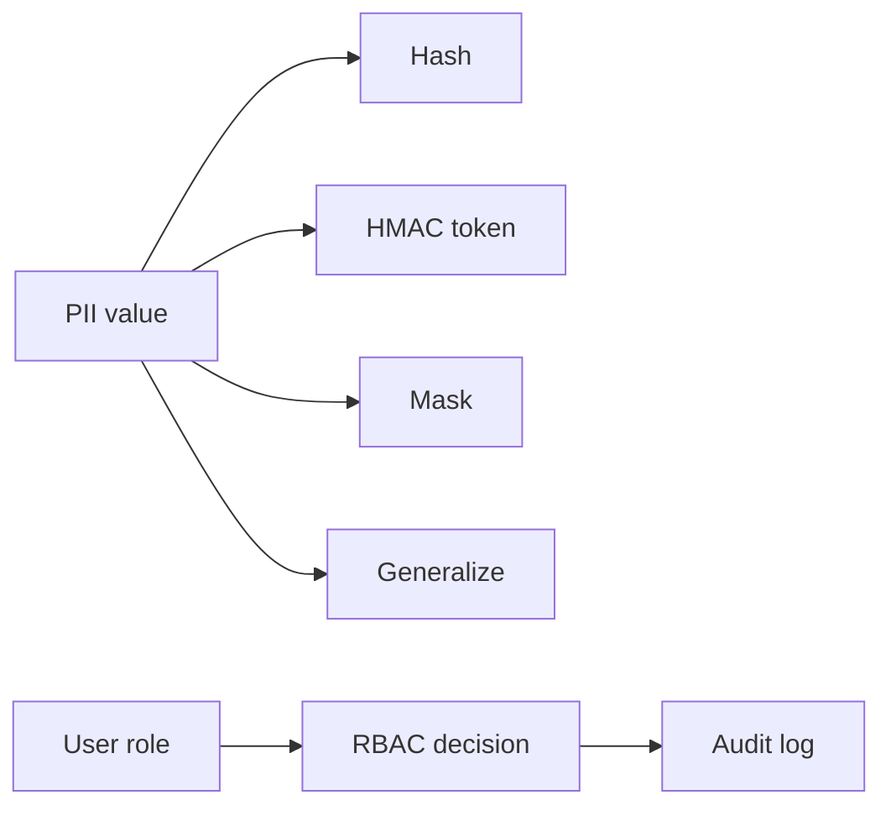

# Security and access-control notes

PIIShield demonstrates the privacy lifecycle requested in the supporting material: minimize collection, classify sensitive values, protect them during processing, control access, monitor activity, and retain only the artifacts needed for review.

## Implemented controls

| Control | Implementation | Purpose |
|---|---|---|
| Hashing | `PIISecurity.hash_value` | Equality checks without reversible storage |
| Tokenization | `PIISecurity.tokenize` | Stable keyed pseudonyms |
| Masking | `PIISecurity.mask_value` | Safe display of structured values |
| Generalization | `PIISecurity.generalize_ip` | Reduce network-location precision |
| RBAC | `AccessController` | Allow or deny dataset actions by role |
| Audit | `data/gold/access_audit.csv` | Evidence of access decisions |

The HMAC secret must come from a secret manager in production. The local simulation is deliberately dependency-light and is appropriate for demonstrating the control boundary in the assignment.