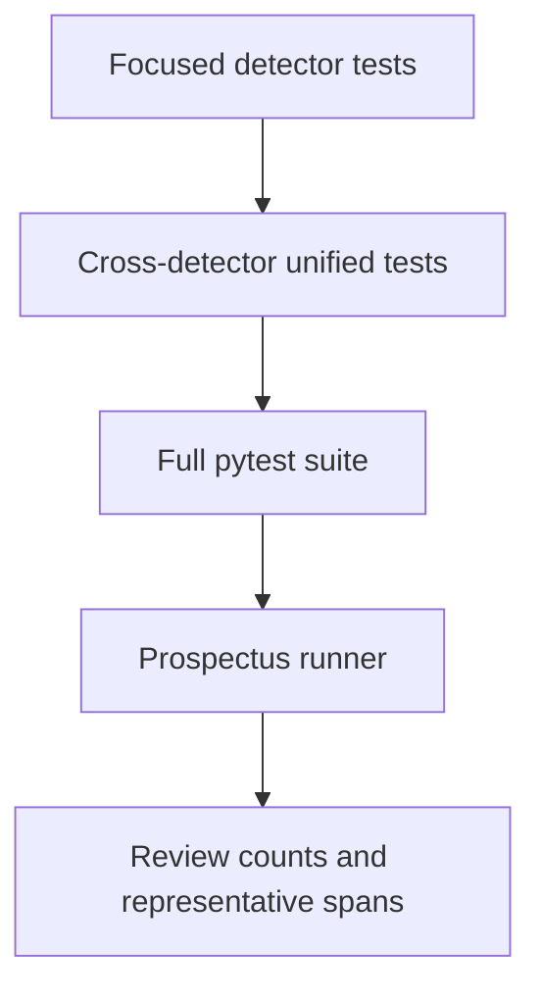

# Testing and verification

## Test layers



## What the tests protect

- Candidate recognition for valid examples.
- Rejection of malformed or invalid values.
- Context requirements for SSN, address, and DOB.
- Numeric validation for phone, IP, and credit-card candidates.
- Person and company false-positive controls.
- Exact `start` and `end` offsets.
- Unified ordering, metadata, and duplicate handling.

## Commands

```powershell
.\venv\Scripts\pytest.exe tests -q
.\venv\Scripts\python.exe src\run_detection.py
.\venv\Scripts\python.exe src\run_redaction.py
.\venv\Scripts\python.exe run.py
.\venv\Scripts\python.exe src\evaluate.py
```

Individual detector checks can be run with:

```powershell
.\venv\Scripts\pytest.exe tests\test_<detector>_detector.py -v
```

## Acceptance invariant

For every returned entity:

```python
text[result["start"]:result["end"]] == result["text"]
```

This keeps downstream redaction, audit logging, and evaluation aligned with the original normalized element.

The final verification run should include the complete pytest suite, the end-to-end `run.py` rebuild, the labeled evaluator, and visual inspection of the generated DOCX. Gold-layer output details are described in [phase5_outputs.md](phase5_outputs.md).